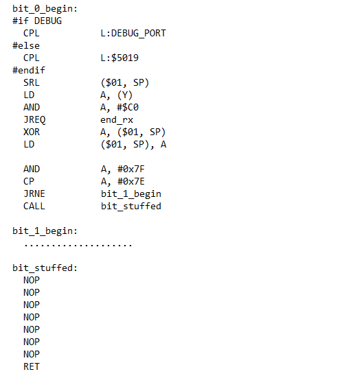

# Giới thiệu:
* Đây là phiên bản sửa đổi và nâng cấp của phiên bản gốc tác giả người Nga ZiB
  Project gốc: https://github.com/ZiB/STM8S-USB/blob/master/device/usb/usb.c
* Phiên bản này đã được sử đổi và nâng cấp để chạy bằng dao động nội RC và chuyển
  sang dùng trình biên dịch IAR.

# Các sửa đổi trong phiên bản:
* Có thể hoạt động với dao động nội RC và bỏ hoàn toàn không cần đến thạch anh. Dao động
  RC đã được tinh chỉnh lên tần số xấp xỉ 16.5MHz (11 chu kỳ máy).
* Có thể sử dụng các chân còn lại của PORTC vào mục đích khác (Input hay Output đều được). Trong phiên
  bản gốc, 2 đường tín hiệu USB được nối vào PORTC và do cấu trúc các lệnh ASM đã viết của USB bản gốc
  khiến các chân còn lại không thể được sử dụng được. Phiên bản nâng
  cấp này đã khắc phục được nhược điểm trên.
* Cố định địa chỉ của chức năng usb_rx và usb_tx giúp chương trình chạy ổn định, không bị thay đổi thời
  gian thực thi khi thay đổi các phần khác của chương trình. Để làm được điều này tôi đã thay đổi
  tệp linker mặc định của trình biên dịch bằng một tệp tin khác. Mục này được cài đặt trong
  **Options -> Linker -> Config -> Override default** tick chọn và chọn tệp tin ***.icf**.
* Chuyển code của usb_received (phiên bản gốc là usb_rx_ok) sang hoàn toàn bằng ASM giúp cố định mã
  khi thay đổi tối ưu của trình biên dịch.
* Tự cấu hình option byte nếu option byte chưa được cấu hình đúng.
* Thêm chức năng tách bit nhồi sau khi nhận được dữ liệu.
* Khắc phục lỗi kết nối lại không nhận USB khi MCU luôn được cấp nguồn liên tục.
* Hoàn thiện các mô tả và thêm mô tả chuỗi. Có thể mô tả được chuỗi dài tùy ý.
* Và còn nhiều các nâng cấp nhỏ khác mà tôi chưa nhớ hết.

# Thiết lập phần cứng:
* Sử dụng nguồn cấp 3.3V. (Nếu bạn sử dụng 5V sẽ cần thêm trở và zener 3.3V để tạo mức logic cho đường
  tín hiệu USB.
* PC7 - "D+"
* PC6 - "D-"
* Trở kéo 1K5 từ PC6 (D-) lên nguồn (3.3V).

# Các phiên bản project:
* **USB_STM8S_HSI_V1**: Phiên bản hỏi vòng USB_Process liên tục trong main giống như phiên bản gốc.
* **USB_STM8S_HSI_V2**: USB_Process tự xác định và được gọi một cách đặc biệt giống như một ngắt
  hệ trống (Nhưng nó chạy ở chế độ không phải ngắt và tất cả các ngắt khác đều có thể chiếm quyền
  sử dụng CPU của nó).

# Các vấn đề khác:
* Vẫn chưa thể tách bit nhồi trực tiếp trong usb_rx. Tôi cũng đã phát triển được thuật toán tách
  bit nhồi trực tiếp trong project này và nó chỉ tốn 4 chu kỳ để thực thi nhưng nó vẫn là chưa đủ
  để có thể sử dụng. Nếu bạn sử dụng thạch anh tần số 24MHz (16 chu kỳ) bạn hoàn toàn có thể thêm vào.
  sau đây là ví dụ các lệnh tôi đã viết để kiểm tra và tách bit nhồi cho bit 0:

# Thông tin liên hệ:
* Facebook: https://www.facebook.com/electricthanhtung (thường xuyên kiểm tra)
* Email: electricthanhtung@gmail.com